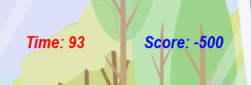
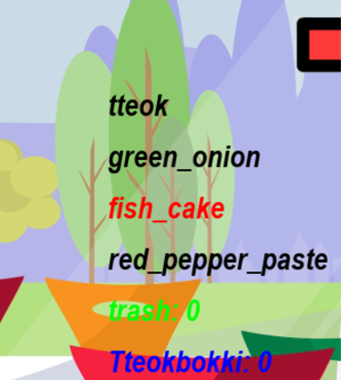
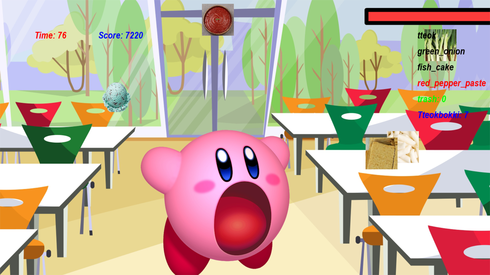

21101199 양효정
요리왕 커비

Pygame 활용
---
   
# <서론>
## 1) 게임 배경
### 우리는 게임시장에서 C++, C#으로 만들었다는 게임은 많이들 들어봤을 것입니다. 하지만 시장에서 파이썬으로 만들었다는 게임은 발견하기가 어렵습니다. 그래서 왜 파이썬으로는 게임을 안 만드는걸까, 못 만드는걸까? 라는 의문에서 시작해 찾다보니 Pygame이라는 라이브러리를 발견했습니다. 이 Pygame라이브러리로 무슨 게임을 만들 수 있을지 생각하다보니 우리가 어릴적 많이 하고 놀았던 똥피하기 게임이 떠올랐습니다. 그래서 이런 기반의 게임을 만들되, 그 외 요소를 추가하면서 왜 시장에서는 파이썬으로 게임을 안만드는걸까? 의문을 풀도록 하였습니다.  
---
   
####

## 2) 게임 발상
### 일반적인 낙석 피하기 게임인데, 새로 추가한 요소는 다음과 같습니다.
#### * 낙석으로 올바른 음식재료와 잘못된 음식재료가 떨어집니다.
##### - 올바른 음식재료: 먹을수록 플레이어의 크기가 커집니다.
##### - 틀린 음식재료: 먹으면 플레이어의 크기가 줄어들고, 10초간 다른것을 못 먹습니다.
####
#### * 아무 음식재료를 먹을수록 점수가 높아지는게 아니라,
#### 제목인 '커비의 요리교실'에 맞게끔 레시피에 맞는 재료들을 모아서
#### 한 음식을 만들어야 더 많은 점수를 주도록 하였습니다.
#### *  피버게이지 시스템을 도입했다. 피버게이지가 가득차면
####  커비가 엄청 커지며, 아무 음식이나 먹어도 상관 없습니다!
---
   
####

## 3) 게임개발자의 기대 목표
### * Pygame 라이브러리를 이용해 파이썬 기반의 게임을 만들도록 합니다.
### * 물체와 플레이어의 충돌 판정을 해보고, 한번만 적용이 되게끔 time.time()을 이용해봅시다.
### * 플레이어의 크기와 이미지를 계속해서 변화시켜봅니다.
### * 화면에 점수, 플레이어, 장애물 등을 출력을 해보도록 합니다.
### * random.randint()를 이용해 장애물들이 랜덤한 위치에서 떨어지도록 해보고, 플레이어가 화면밖에 나가지 않도록 설정합니다.
### * 낙하물이 떨어지도록 스피드를 조절하고, 왼쪽&오른쪽 방향키를 눌러 플레이어가 x좌표를 움직이도록 설정합니다.
### * 피버 게이지를 구현해보도록 합니다.
---
   
## 4) 플레이어의 기대 목표
### * 이 게임의 플레이 연령대는 유아입니다. 
### * 이 게임을 통해 버려 아무음식이나 먹지 않고, 필요한 재료위주로 먹는 효율적인 자세를 가지게 됩니다. 
### * 음식에 쓰레기가 들어가면 안되는 것을 인지하게 되고, 쓰레기를 피해 커비를 움직이는 컨트롤을 습득하게 됩니다.
---

## 5) 라이센스
### * 이 프로그램은 GNU GPL License로 배포합니다. 개인적, 혹은 내부적 이용일때는 소스코드를 공개하지 않아도 되지만, 외부 배포시 해당 소프트웨어의 전체 소스코드를 공개해야 할 것입니다.

###   
---
***
###
# <본론>
## 1) 게임 구성 요소 소개
### 1. 게임 플레이어
#### * 평상시 커비
</img> 
#### * 음식을 먹은 커비
</img> 

### 2. 게임 장애물
#### 올바른 음식 재료
##### * 떡(tteok)
</img> 

##### * 파(green_onion)
</img> 

##### * 고추장(red_pepper_paste)
</img> 

##### * 오뎅(fish_cake)
</img> 

   
#### 3. 잘못된 음식 재료
##### * 민초
</img> 

### 2. 게임 게이지
#### * 게이지는 우상에 빨간 막대그림입니다!
</img> 
#### * 올바른 음식 재료를 먹으면 일정량 게이지가 찹니다!
#### * 잘못된 음식재료인 **민초**를 먹으면 커비가 아파요! 일정량 게이지가 깎입니다!
#### * 게이지가 가득차면, 10초간 피버타임! 커비가 커져요!
####  피버타임 동안은 민초를 알아서 뱉습니다!

#### 

### 3. 화면 screen
</img> 

#### * 좌상에 빨간글씨로, 남은 시간이 나타납니다!
####  그 오른쪽에는 파란글씨로, 현재까지의 점수가 나타납니다!

</img> 
#### * 우상에는 게이지가 표시되어 있습니다!
####  그 아래에 빨간글씨로 먹어야하는 음식재료와,
####  검은글씨로 이미 먹은 음식재료,
####  잘못된 음식재료를 먹은 횟수(Trash),
####  현재까지 완성된 떡볶이 요리의 개수가 표시되어있습니다!

### 
   
---

###

## 2) 게임 방법 소개
### 1. 게임 시작 버튼을 누릅니다!
### 2. 키보드의 좌, 우 방향키를 이용해 하늘에서 떨어지는 음식을 먹읍시다!
###  커비는 올바른 음식을 먹을수록 크기가 커져요!
</img> 

### 3. 올바른 음식 재료를 먹으면 +5점을 얻을 수 있어요!
###  올바른 음식 재료인 떡, 파, 고추장, 어묵을 종류 하나씩 먹으면 떡볶이 하나가 완성되면서, 1000점을 획득할 수 있어요!
### 4. 잘못된 음식 재료인 **민초**를 먹으면 커비가 배탈나요! 🤮🤮 
###  점수 -500점, 게이지 모두 깎이며, 지금까지 모았던 재료들을 다 토해내요..
###  또한 충격으로 10초간 적절한 음식을 먹을 수 없어요 😢😢
###  커졌던 몸집도 처음상태로 돌아가지게 되어요..
###  커비에게 좋은 음식만 먹입시다!
</img> 
### 4. 피버게이지가 일정 이상이 쌓이면 10초간 피버타임에 들어가게 되어요!
###  피버타임 동안은 big-커비가 화면에 나타납니다!
###  피버타임동안에는 음식재료를 마음대로 먹도록 해요!
</img> 

### 5. 주어진 제한시간이 끝나면 게임이 종료됩니다!   
   
###
### ☆ 점수 정리 ☆
#### - 옳은 재료 1개당 +5점
#### - 떡볶이 하나 완성당 +1000점
#### - 민초 하나당 -500점
###
### ※ TIP: 아무 재료를 모으기보다는, 떡볶이에 필요한 재료 위주로 모으도록 해요!

###

---

## 3) 사용한 라이브러리들
### * pygame - image.load, transform.scale, image.save, time.Clock(), time.get_ticks(), event.get(), KEYDOWN, K_LEFT, K_RIGHT, get_rect, colliderect, mixer.Sound, play(), screen.blit, game_font.render,
### * random - randint()
### * time - sleep, time()

---
 
## 4) 코드 소개

### 게임 설정 부분
#### 1. 화면 기본 설정
##### screen_width = 1920, screen_height = 1080
###
###
#### 2. 캐릭터 크기 설정
##### pygame.image.load, pygame.transform.scale, pygame.image.save 사용
###
#### 3. 낙하물 설정(떡, 파, 고추장, 어묵, 민초)
###
#### 4. time 설정
##### 변수 설명
##### * total_time: 제한시간
##### * sick: 커비가 민초를 안먹었는지 확인해주는 변수.
#####  True일때 민초를 먹지 않았다고 설정됩니다. True일 때 민초를 먹으면 아프게 되어요.
###
#### 5. gauge 설정
#### 6. change_eat_size(): 낙하물을 먹었을 때 플레이어 사이즈를 변경하는 부분
---

### 

### 게임 시작
#### 1. 왼쪽키 누르면 플레이어가 왼쪽으로, 오른쪽키 누르면 플레이어가 오른쪽으로 이동시킵니다(event.type과 event.key 사용). 또한 낙하물이 아래로 떨어지게끔 speed와 y_pos를 조절시킵니다.
#### 2. 플레이어 or 낙하물이 화면밖에 있다면 화면 안으로 가게끔 합니다(random 사용).
#### 3. 플레이어와 낙하물 충돌처리(점수, 게이지 조작, 충돌 소리 내기)
##### 커비가 아픈상태가 아니여야하고,
#####  중복처리를 방지하기 위해 동일 낙하물을 맞은지 0.5초이내가 아니여야하며(time.time() 사용),
#####  충돌상태(character_rect.colliderect(낙하물)이라면 실행됩니다.
###
#### 4. 민초를 먹은 상태라면, 점수를 깎고 아픈상태를 주도록 합니다. 또한 time.time()을 이용해 10초동안은 다른 음식을 못먹는 상태로 바꿉니다.
#### 5. 피버게이지가 특정 x값 이하에 위치하게 되면 피버타임을 발동시킵니다. 이때는 민초를 먹어도 되게끔 설정합니다.(gauge_count = 1)
#### 6. 요리완성시 떡볶이 카운트 +1하고, 모은 재료들 초기화합니다.
#### 7. 주어진 시간 100초가 지나면 5초간 화면이 정지된 후 게임이 종료됩니다!
---
###
### 화면에 출력하기 (screen.bilt 사용)
#### * 배경, 캐릭터, 낙하물, 기타 UI 텍스트 출력하기(game_font.render 사용)

###

---
***

### 

# <결론>
## 느낀점
---
### 새로운 파이썬 라이브러리와 여러 함수를 사용할 수 있는 기회가 되었습니다. pygame의 경우 수업중에도 다뤄본적이 없었어서 불안했었는데 구글에 잘 나와있어서 다행이었다. 하면서 느낀점은 pygame 라이브러리를 이용한 파이썬 게임은 생각보다 렉이 많이 걸렸었습니다. 그래서 생각해보니, 파이썬의 단점은 C++이나 C#보다 속도가 느리다는 점이었습니다. 이러한 이유로 시중게임에는 파이썬으로 만든 게임보다는 다른 언어를 쓴 게임들 위주로 나오는 것이지 않을까 싶습니다. 그래도 파이썬으로 게임을 만드는 것 자체는 다른언어로 만든 게임처럼 다양한 라이브러리들(충돌 판정, rect사이즈 구하기, 오브젝트 크기 조정, random, time, 소리 출력, screen출력 등)을 지원하므로 게임 자체를 만드는 것에는 큰 어려움은 없을 것입니다. 하지만 게임은 개발자만이 중요한게 아니라 플레이어와의 상호작용도 중요하므로 시장에서는 렉이 덜 걸리는 다른 언어로 만들어야 합니다. 그래도 수업시간에 배운 것과 배우지 않은 것을 오픈소스를 찾은뒤 응용해 완성시켜서 뿌듯합니다.
---
## 어려웠던 점
### * pygame 라이브러리를 사용할 때 커비가 먹는 이미지와 평상시 이미지의 크기를 늘리고 줄이는 부분이 어려웠었습니다. 음식을 먹을때마다 크기를 키우고, 민초를 먹거나 피버타임이 끝나면 크기를 원상태로 돌려야하는데 안돌아가는 오류도 있었습니다. 
### * 낙하물을 맞았는데 점수가 맞는 판정일때 거의 0.1초 간격으로 점수가 늘어나서 이를 어떻게 처리를 해야할까 고민을 했었습니다. 이는 처음 맞는 판정일 때 0.5초간은 무적상태를 지정함으로써 문제를 해결했습니다. 자세히 설명해보자면 처음 맞는 판정일때의 시간을 first_time이라고 했을 때,  first_time = time.time()으로 지정하고, time.time() - first.time() > 0.5일때까지 무적상태를 지정하였습니다.
### * 피버타임 지정하는 것도 어려웠습니다. 여기도 피버타임 판정을 한번만 해야하고, 10초간 유지해야 할 필요가 있었기 때문입니다. 또한 sick 상태일때가 되지않도록 설정도 해야하고 여러 변수를 추가하고, 상태 조건을 추가하는 등의 작업이 일일히 들어가야했습니다.
---
###

## 개선할 점
### * 게임을 시작할 때, 처음에 게임시작 버튼, 게임정보 버튼, 제작자 정보가 담긴 UI를 추가하고 싶었습니다. 그런데 시간부족으로 추가하지 못해 아쉽습니다. 시간이 더 주어진다면 이부분을 추가하고 싶습니다.
### * 음식재료와 민초를 동시에 먹었을 때, 해당 음식재료가 삭제가 안되는 버그가 있습니다. 이는 음식재료 삭제되는 타이밍과 획득되는 타이밍이 겹쳐서 생긴 일 입니다. 다음에 이 게임을 손볼 일이 있다면, 이 버그를 고쳐보고 싶습니다. 이는 우선순위를 지정하는 방식으로 고칠 수 있을 것 같습니다.

###

---
***

####

# 참고한 사이트
* https://velog.io/@wltn39/%ED%8C%8C%EC%9D%B4%EC%8D%AC-%EA%B2%8C%EC%9E%84-1-%EB%98%A5%ED%94%BC%ED%95%98%EA%B8%B0
* https://blog.naver.com/PostView.nhn?blogId=topblade71&logNo=221507282811&parentCategoryNo=&categoryNo=13&viewDate=&isShowPopularPosts=true&from=search
* https://kr.freepik.com/free-vector/diner-interior-illustration_3296515.htm
