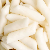
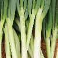
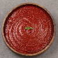
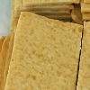
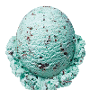
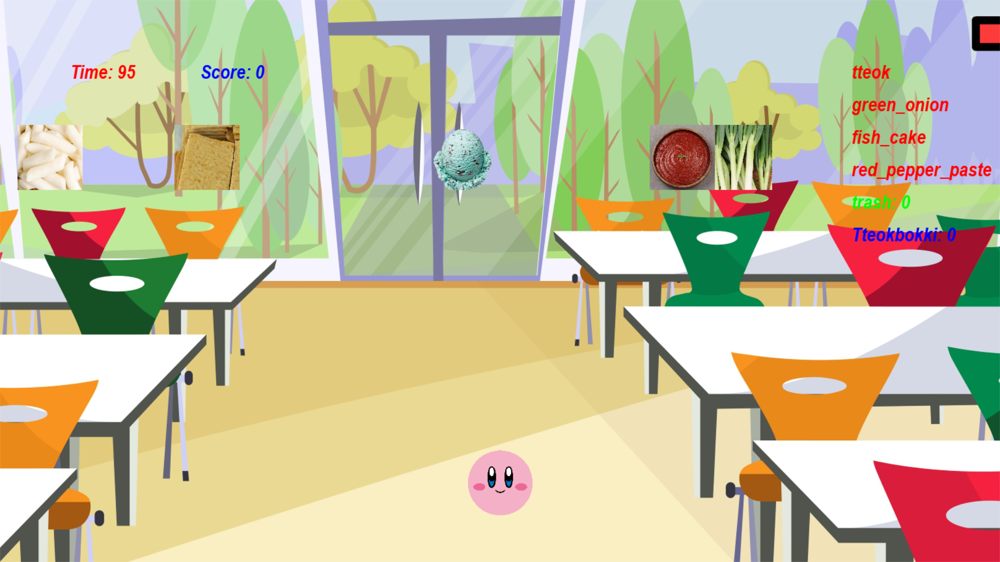

21101199 양효정
요리왕 커비

Pygame 활용
---
   
# <서론>
## 1) 게임 배경
### 우리는 게임시장에서 C++, C#으로 만들었다는 게임은 많이들 들어봤을 것입니다. 하지만 시장에서 파이썬으로 만들었다는 게임은 발견하기가 어렵습니다. 그래서 왜 파이썬으로는 게임을 안 만드는걸까, 못 만드는걸까? 라는 의문에서 시작해 찾다보니 Pygame이라는 라이브러리를 발견했습니다. 그래서 이 Pygame라이브러리로 무슨 게임을 만들 수 있을까.. 생각하다보니 우리가 어릴적 많이 하고 놀았던 똥피하기 게임이 떠올랐습니다. 그래서 이런 기반의 게임을 만들되, 그 외 요소를 추가하면서 왜 시장에서는 파이썬으로 게임을 안만드는걸까? 의문을 풀도록 하였습니다.  
   
####

## 2) 게임 발상
### 일반적인 낙석 피하기 게임인데, 새로 추가한 요소는 다음과 같습니다.
#### * 낙석으로 올바른 음식재료와 잘못된 음식재료가 떨어집니다.
##### - 올바른 음식재료: 먹을수록 플레이어의 크기가 커집니다.
##### - 틀린 음식재료: 먹으면 플레이어의 크기가 줄어들고, 10초간 다른것을 못 먹습니다.
####
#### * 아무 음식재료를 먹을수록 점수가 높아지는게 아니라,
#### 제목인 '커비의 요리교실'에 맞게끔 레시피에 맞는 재료들을 모아서
#### 한 음식을 만들어야 더 많은 점수를 주도록 하였습니다.
#### *  피버게이지 시스템을 도입했다. 피버게이지가 가득차면
####  커비가 엄청 커지며, 아무 음식이나 먹어도 상관 없습니다!
   
####

## 3) 게임으로 얻을 수 있는 기대 목표
### * Pygame 라이브러리를 이용해 파이썬 기반의 게임을 만들도록 한다.
### * 물체와 플레이어의 충돌과의 시간을 time.time()을 이용해 다뤄본다.
### * 플레이어의 크기를 계속해서 변화시켜본다.
### * 화면에 점수, 플레이어, 장애물 등을 출력을 해보도록 한다.
### * 피버 게이지를 구현해보도록 한다.
   
###   
---
***
###
# <본론>
## 1) 게임 구성 요소 소개
### 1. 게임 플레이어
#### * 평상시 커비
</img> 
#### * 음식을 먹은 커비
</img> 

### 2. 게임 장애물
#### 올바른 음식 재료
##### * 떡(tteok)
</img> 

##### * 파(green_onion)
</img> 

##### * 고추장(red_pepper_paste)
</img> 

##### * 오뎅(fish_cake)
</img> 

   
#### 3. 잘못된 음식 재료
##### * 민초
</img> 

### 2. 게임 게이지
#### * 게이지는 우상에 빨간 막대그림입니다!
#### * 올바른 음식 재료를 먹으면 일정량 게이지가 찹니다!
#### * 잘못된 음식재료인 **민초**를 먹으면 커비가 아파요! 일정량 게이지가 깎입니다!
#### * 게이지가 가득차면, 10초간 피버타임! 커비가 커져요!
####  피버타임 동안은 민초를 알아서 뱉습니다!

#### 

### 3. 화면 screen
</img> 

#### * 좌상에 빨간글씨로, 남은 시간이 나타납니다!
####  그 오른쪽에는 파란글씨로, 현재까지의 점수가 나타납니다!
#### * 우상에는 게이지가 표시되어 있습니다!
####  그 아래에 빨간글씨로 먹어야하는 음식재료와,
####  검은글씨로 이미 먹은 음식재료,
####  잘못된 음식재료를 먹은 횟수(Trash),
####  현재까지 완성된 떡볶이 요리의 개수가 표시되어있습니다!

### 
   
---

###

## 2) 게임 방법 소개
### 1. 게임 시작 버튼을 누릅니다!
### 2. 키보드의 좌, 우 방향키를 이용해 하늘에서 떨어지는 음식을 먹읍시다!
###  커비는 올바른 음식을 먹을수록 크기가 커져요!
</img> 

### 3. 올바른 음식 재료를 먹으면 +5점을 얻을 수 있어요!
###  올바른 음식 재료인 떡, 파, 고추장, 어묵을 종류 하나씩 먹으면 떡볶이 하나가 완성되면서, 1000점을 획득할 수 있어요!
### 4. 잘못된 음식 재료인 **민초**를 먹으면 커비가 배탈나요! 🤮🤮 
###  점수 500점, 게이지 모두 깎이며, 지금까지 모았던 재료들을 다 토해내요..
###  또한 충격으로 10초간 적절한 음식을 먹을 수 없어요 😢😢
###  커졌던 몸집도 처음상태로 돌아가지게 되어요..
###  커비에게 좋은 음식만 먹입시다!
### 4. 피버게이지가 일정 이상이 쌓이면 10초간 피버타임에 들어가게 되어요!
###  피버타임 동안은 big-커비가 화면에 나타납니다!
###  피버타임동안에는 음식재료를 마음대로 먹도록 해요!
### 5. 주어진 제한시간이 끝나면 게임이 종료됩니다!   
   
### ※ TIP: 재료 한개당 +5점, 떡볶이 하나 완성당 +1000점을 얻을 수 있으니
###  아무 재료를 모으기보다는, 필요한 재료 위주로 모으도록 해요!

###

---
***

### 

# <결론>

###

---
***

####

# 참고 사이트
* https://velog.io/@wltn39/%ED%8C%8C%EC%9D%B4%EC%8D%AC-%EA%B2%8C%EC%9E%84-1-%EB%98%A5%ED%94%BC%ED%95%98%EA%B8%B0
* https://blog.naver.com/PostView.nhn?blogId=topblade71&logNo=221507282811&parentCategoryNo=&categoryNo=13&viewDate=&isShowPopularPosts=true&from=search
* https://kr.freepik.com/free-vector/diner-interior-illustration_3296515.htm
